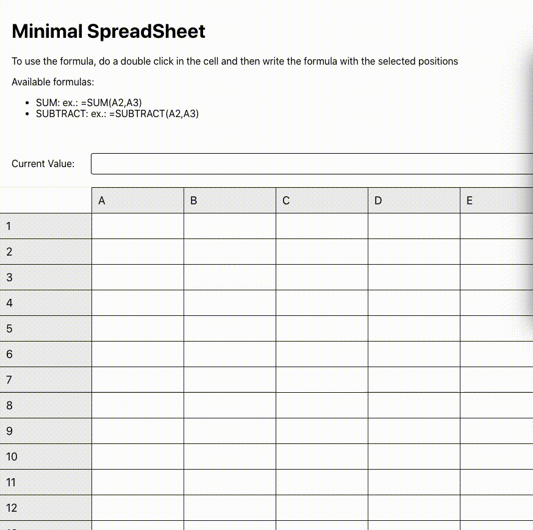

# Minimal SpreadSheet with reactjs

This repo contain a poc for spread sheet in reactjs with the `SUM` and `SUBTRACT` formulas.
To use the formula, do a double click in the cell and then write the formula with the selected positions
Available formulas: 

<ul>
  <li>SUM: ex.: =SUM(A2,A3)</li>
  <li>SUBTRACT: ex.: =SUBTRACT(A2,A3)</li>
</ul>

### Running the app

- yarn install && yarn start
